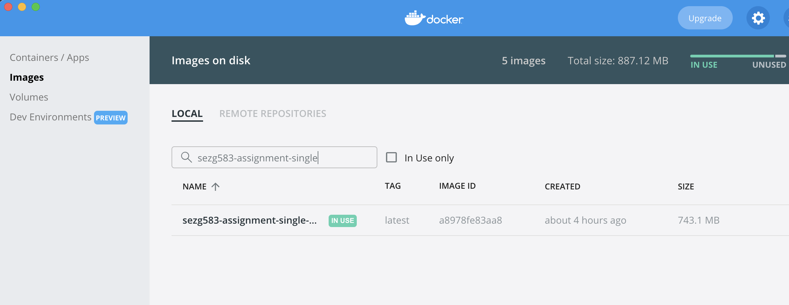
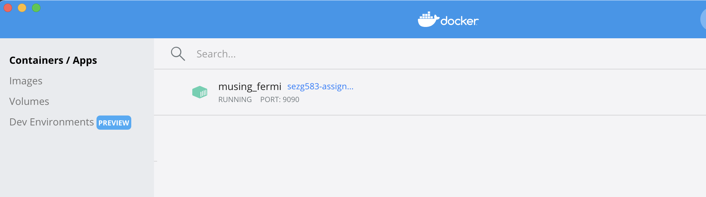
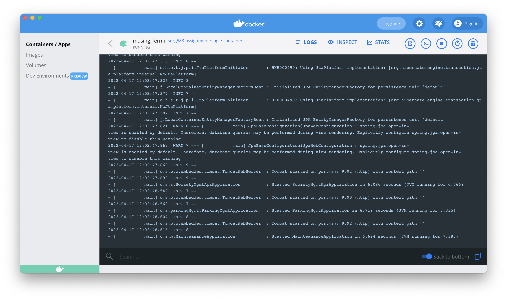

# SEZG583 Scalable Services Assignment 1

## Running multiple microservices in a single docker container

This project contains scripts that are used to build the artifacts for the 3 microservices developed as part of Assignment 1 and create a single docker image that can run all these services in the same container.

### Docker image having all 3 microservice JARs


### Single-container having all 3 microservices running in Docker Desktop


### Container Logs


To deploy the services in a single container, the following commands are used:
- To build the artifacts (you need to have Java 8)
	```bash
	./clone-repo-step.sh
	./build-jars-step.sh
	```
- To build the docker image (run from root for single-docker-container repo, you need to have docker/docker desktop installed)
	```bash
	docker image build . -t=sezg583-assignment-single-container
	```
- To run the docker image (you need to have docker/docker desktop installed)
	```bash
	docker run -d -p 9090:9090 -p 9091:9091 -p 9092:9092 sezg583-assignment-single-container
	```

Below are few other helper docker commands used:
- To view the built docker images
	```bash
	docker image ls
	```
- To delete a docker image
	```bash
	docker image rm sezg583-assignment-single-container
	```
- To view running docker containers
	```bash
	docker ps
	```
- To stop a docker container
	```bash
	docker stop <container_id>
	```
- To stop a docker container
	```bash
	docker stop <container_id>
	```
- To remove a docker container
	```bash
	docker rm <container_id>
	```